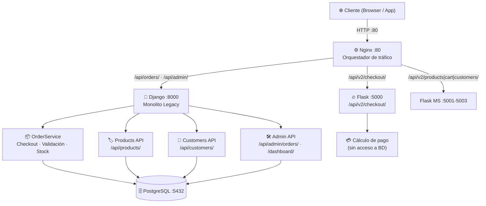

# Migración a Microservicios (Strangler Pattern)

---

## Contexto del Proyecto

**CEFUSA E-Commerce** es una API backend desarrollada con Django y Django REST Framework que simula el proceso de compra de una tienda online. El sistema implementa una **arquitectura por capas** (Presentación → Aplicación → Dominio → Infraestructura) con patrones de diseño para construir órdenes de compra, validar productos y manejar clientes.

El **Entregable 1** consolidó el núcleo de negocio con dos patrones clave:
- **Builder Pattern** — `OrderBuilder` y `ProductBuilder` para construcción validada paso a paso.
- **Factory Pattern** — `NotificationFactory` y `PaymentProcessorFactory` para selección de implementaciones según entorno (development / production).

El **Taller 02** aplica el **Strangler Pattern** para migrar el módulo de pagos del monolito Django hacia un microservicio Flask independiente, orquestando el tráfico mediante Nginx como proxy inverso.

---

## Estado actual del repositorio (Strangler en curso)

| Capacidad | Ruta API | Servicio | BD |
|---|---|---|---|
| Catálogo / stock | `/api/v2/products/`, `/api/v2/inventory/` | `ms_inventory` (:5001) | SQLite |
| Carrito | `/api/v2/cart/` | `ms_cart` (:5002) | en memoria / servicio |
| Clientes (admin + sync checkout) | `/api/v2/customers/` | `ms_customers` (:5003) | SQLite |
| Pago (procesamiento) | `/api/v2/checkout/` | `flask_payment` (:5000) | ninguna |
| Órdenes (persistencia + admin) | `/api/orders/`, `/api/admin/` | Django (:8000) | PostgreSQL |

`OrderService` en Django **orquesta** los microservicios vía HTTP (`orders/infra/microservice_clients.py`) y guarda la orden en PostgreSQL. El frontend usa Vite → Nginx (:80) → servicios.

---

## Módulo Estrangulado (histórico del taller): Procesamiento de Pagos

### Matriz de Decisión (entregable original)

| Módulo | Decisión original taller | Estado en código hoy |
|---|---|---|
| Customers | Mantener en Django | **Estrangulado** → `ms_customers` (+ sync Django para FK) |
| Products / Inventory | Mantener en Django | **Estrangulado** → `ms_inventory` |
| Orders / Payment | Estrangular pagos → Flask | Pagos en `flask_payment`; órdenes siguen en Django |

### Justificación

1. **Cuello de botella identificado:** `OrderService.create_order()` ejecuta **8 pasos secuenciales bloqueantes** (validación → cliente → builder → stock → pago → notificación), lo que en carga alta puede generar timeouts en el monolito.
2. **Alta frecuencia de cambio:** Las reglas de pago, descuentos y procesadores externos cambian con frecuencia; conviene desplegarlas de forma aislada sin reiniciar todo el sistema.
3. **Bajo acoplamiento con la BD:** `PaymentProcessorFactory` ya estaba completamente desacoplado de la base de datos (no escribe ni lee registros propios), lo que hace la extracción limpia y sin romper ninguna `ForeignKey`.
4. **Riesgo controlado:** El monolito Django sigue funcionando sin modificaciones en `/api/v1/`. Solo se agrega la nueva ruta `/api/v2/checkout/` en Flask.

---

## Arquitectura Final

### Diagrama de Infraestructura Completa



### Descripción de servicios Docker

| Servicio | Imagen | Puerto interno | Puerto host | Red | Rol |
|---|---|---|---|---|---|
| `db` | postgres:16-alpine | 5432 | — | cefusa_net | Base de datos |
| `django_app` | build: `./Dockerfile` | 8000 | — | cefusa_net | Monolito Django (legacy) |
| `flask_payment` | build: `./flask_payment_service/Dockerfile` | 5000 | — | cefusa_net | Microservicio de pagos |
| `nginx` | nginx:1.27-alpine | 80 | **80** | cefusa_net | Reverse proxy / enrutador |

---

## Separación Técnica

### Legacy intacto (sin modificaciones)

```text
POST /api/orders/checkout/ → Nginx → Django → OrderService (8 pasos) → respuesta
GET  /api/products/        → Nginx → Django → ProductService
GET  /api/customers/       → Nginx → Django → CustomerService
```

### Ruta estrangulada (nueva)

```text
POST /api/v2/checkout/ → Nginx → Flask Payment Service → respuesta JSON
```

El monolito **no se elimina ni se modifica**. El Strangler Pattern redirige progresivamente solo la funcionalidad elegida hacia el nuevo microservicio.

---

## Microservicio Flask — Detalles de Implementación

### Endpoint principal

```
POST /api/v2/checkout/
Content-Type: application/json
```

**Request body:**
```json
{
  "amount": 150.0,
  "discount_code": "SAVE10",
  "order_reference": "ORD-42"
}
```

**Response exitosa (200):**
```json
{
  "success": true,
  "transaction_id": "MOCK-482031",
  "subtotal": 150.0,
  "discount_code": "SAVE10",
  "discount_amount": 15.0,
  "total": 135.0,
  "processor": "mock",
  "order_reference": "ORD-42"
}
```

**Errores estructurados (400):**
```json
{ "success": false, "error": "'amount' es obligatorio" }
```

### Health check

```
GET /health → { "status": "ok", "service": "flask-payment-service" }
```

### Lógica de descuento

- Si se envía `discount_code`: se aplica un **10 % de descuento** sobre el monto.
- Si no se envía: `discount_amount = 0`, `total = amount`.
- El `ENV_TYPE` controla si el procesador es `mock` (desarrollo) o `real` (producción).

---

## Infraestructura Docker

### Enrutamiento Nginx (Strangler Pattern)

```nginx
upstream django_backend { server django_app:8000; }
upstream flask_backend  { server flask_payment:5000; }

server {
    listen 80;

    # Health check de Nginx
    location /nginx-health {
        return 200 "OK\n";
        add_header Content-Type text/plain;
    }

    # ── Microservicio Flask (NUEVO /api/v2/) ──────────────
    location /api/v2/ {
        proxy_pass       http://flask_backend;
        proxy_set_header Host $host;
        proxy_set_header X-Real-IP $remote_addr;
        proxy_read_timeout 30s;
    }

    # ── Monolito Django (LEGACY /api/v1/ y resto) ─────────
    location / {
        proxy_pass       http://django_backend;
        proxy_set_header Host $host;
        proxy_set_header X-Real-IP $remote_addr;
        proxy_read_timeout 60s;
    }
}
```

### Archivos de infraestructura

```
CEFUSAE-Commerce/
├── Dockerfile                          ← Imagen Django (monolito)
├── docker-compose.yml                  ← Orquestación de 4 servicios
├── nginx/
│   ├── nginx.conf                      ← Config para entorno local (sin Docker)
│   └── nginx.docker.conf               ← Config para Docker Compose
└── flask_payment_service/
    ├── app.py                          ← Microservicio Flask
    ├── requirements.txt
    ├── test_app.py                     ← Tests de integración
    └── Dockerfile
```

---

## Evidencia de Pruebas

### Tests del microservicio Flask

```bash
cd flask_payment_service
python -m pytest test_app.py -v
```

**Cobertura de tests implementados:**

| Clase de test | Casos cubiertos |
|---|---|
| `TestHealth` | Health check HTTP 200, body `status: ok` |
| `TestCheckoutSuccess` | Sin descuento, con descuento 10%, transaction_id presente, order_reference reflejado |
| `TestCheckoutErrors` | Sin body, sin `amount`, `amount` no numérico, `amount` negativo, `amount` cero |

Resultado validado: **todos los tests en verde** (`pytest -v`).

### Estado del stack Docker

```bash
docker compose ps
```

Servicios activos: `db`, `django_app`, `flask_payment`, `nginx`.

### Validaciones HTTP ejecutadas

```bash
# Health check Nginx
curl http://localhost/nginx-health

# Django legacy (sin cambios)
curl http://localhost/api/products/
curl http://localhost:8000/api/products/

# Flask microservicio (nueva ruta)
curl -X POST http://localhost/api/v2/checkout/ \
  -H "Content-Type: application/json" \
  -d '{"amount": 100.0, "discount_code": "SAVE10", "order_reference": "TEST-1"}'

# Health check Flask
curl http://localhost/api/v2/health
```

Resultado validado: endpoints respondiendo HTTP 200 en todas las rutas.

### Integración Frontend + Backend

El frontend React/Vite se ejecuta fuera de Docker y se conecta al backend dockerizado mediante proxy de Vite hacia Nginx:

| Componente | URL |
|---|---|
| Frontend (React) | `http://localhost:3000` |
| Nginx (proxy) | `http://localhost` |
| Django directo | `http://localhost:8000` |
| Flask directo | `http://localhost:5000` |

Vite redirige `/api/*` → `http://localhost` (Nginx), que a su vez enruta:
- `/api/v2/*` → `flask_payment:5000`
- Resto → `django_app:8000`

### Datos de prueba (seed)

```bash
docker compose exec django_app sh -lc "cd /app/CEFUSAECommerce ; python seed_products.py"
docker compose exec django_app sh -lc "cd /app/CEFUSAECommerce ; python seed_customers_orders.py"
```

---

## Antes vs. Después (Impacto del Strangler Pattern)

**Antes (Monolito puro):**
```
POST /api/orders/checkout/ → Django → OrderService (8 pasos bloqueantes) → respuesta
```

**Después (Strangler Pattern activo):**
```
POST /api/v1/checkout/   → Nginx → Django         (legacy, sin cambios)
POST /api/v2/checkout/   → Nginx → Flask Payment  (microservicio aislado)
```

| Métrica | Antes | Después |
|---|---|---|
| Escalabilidad del módulo de pagos | Ligada al monolito | Independiente (escala solo Flask) |
| Riesgo de deploy en pagos | Alto (reinicia todo Django) | Bajo (solo se reinicia Flask) |
| Cobertura de tests de pagos | Integrados en Django | Tests aislados, rápidos, sin BD |
| Tiempo de respuesta bajo carga | Bloqueado por los 8 pasos | Flask responde sin tocar la BD |
| Posibilidad de cambiar el procesador | Requería tocar `factories.py` | Basta con cambiar `ENV_TYPE` |

---

## Ejecución del Proyecto

### Opción Docker (recomendada)

```bash
# Levantar todos los servicios
docker compose up --build

# Detener
docker compose down
```

### Opción local (scripts PowerShell)

```powershell
# Iniciar Django + Flask + Nginx localmente
.\start.ps1

# Detener
.\stop.ps1
```

### Correr solo el microservicio Flask

```bash
cd flask_payment_service
pip install flask pytest
python app.py
# En otra terminal:
python -m pytest test_app.py -v
```

---

## Equipo

| Persona | Rama | Responsabilidad |
|---|---|---|
| Sebastian Salazar  | `feat/flask-service` | Microservicio Flask (`app.py`, `Dockerfile`) |
| Andres Velez y Nathalia Cardoza| `feat/docker-infra` | Docker + Nginx (`docker-compose.yml`, `nginx.conf`) |
| Andres Velez y Nathalia Cardoza | `feat/tests-and-docs` | Tests (`test_app.py`) + Wiki + Merge final |